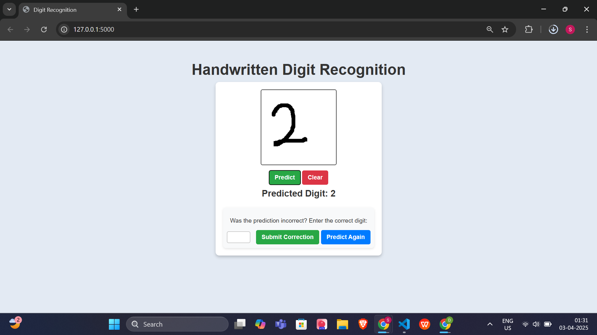

# Handwritten Digit Recognition  

## Overview  
This is a web-based Handwritten Digit Recognition System that allows users to draw digits on a canvas and predicts them using a Convolutional Neural Network (CNN). The model is trained on the MNIST dataset and can be dynamically retrained using user corrections.  

## Features  
- Digit Prediction: Users can draw a digit (0-9) on a canvas, and the system predicts it.  
- Correction & Learning: Users can correct incorrect predictions, and the model learns from them.  
- Retraining Mechanism: The system retrains itself with corrected images.  
- Interactive Web UI: Built using HTML, CSS, and JavaScript (Canvas API).  
- Deep Learning Model: Uses PyTorch for training and inference.  

## Frontend Preview  
  

## Tech Stack  
- Frontend: HTML, CSS, JavaScript (Canvas API)  
- Backend: Flask (Python)  
- Machine Learning: PyTorch, CNN (Convolutional Neural Network)  
- Dataset: MNIST (Modified National Institute of Standards and Technology)  
- Deployment: Localhost (can be extended to cloud platforms)  

## Installation & Setup  

### 1. Clone the Repository  
```bash
git clone https://github.com/D3vn4/HandwrittenDigitRecognition.git
cd HandwrittenDigitRecognition
